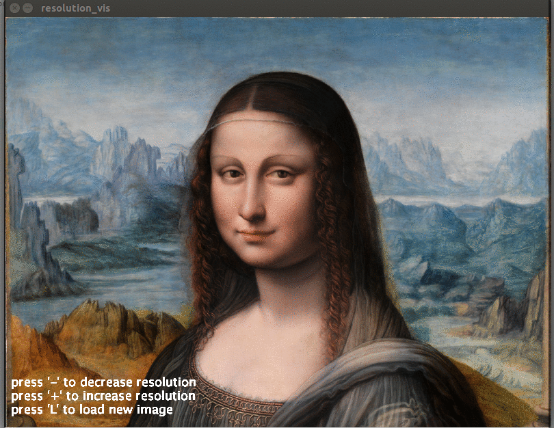

# resolution_vis
A sketch that takes an image and stylistically averages the pixel colours as the resolution changes, 
witten using Processing (https://processing.org)

Uses spatial convolution to reduce the resolution and produce a new image.

# the code
The main entry point is in resolution_vis.pde, which contains the setup() and draw()functions. 
Processing calls setup() once at startup and then draw() once every frame.

resolution_vis.pde  - Main entry point, contains main drawing loop

# how to use
Download Processing here: http://processing.org
Copy the files in this repo into the default sketchbook and run using the Processing GUI/IDE.

Change resolution by pressing '-' or '+' and load a new image by pressing 'L'

# current screenshots

